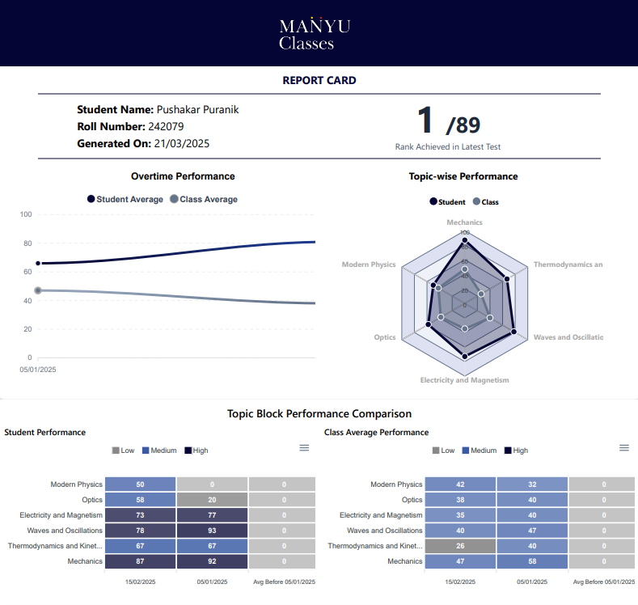
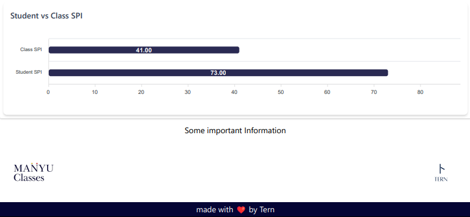
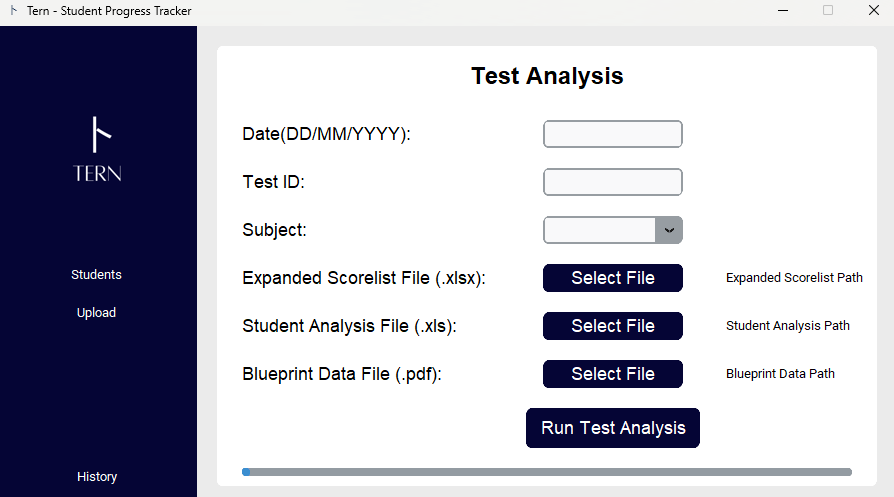
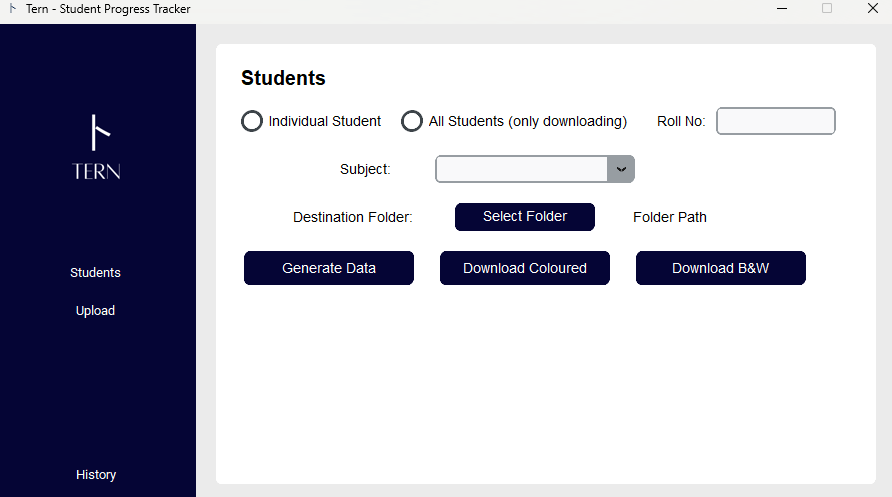

<p align="center">
  
</p>

# 🐦 Tern – Student Performance Analysis

[](https://www.python.org/)
[](https://nodejs.org/)
[](https://tailwindcss.com/)

---

## About

**Tern** is a student performance analytics platform designed to simplify exam result processing and provide clear, data-driven insights for students and educators.

By integrating with **Addmen OMR V25**, Tern automatically extracts and processes student responses from scanned OMR sheets. On the backend, **Python** and **Node.js** evaluate results and maintain performance history. On the frontend, a responsive **Tailwind CSS** interface visualizes trends through interactive graphs and charts.

---

## Features
- **OMR Integration** – Seamless data extraction from Addmen OMR V25
- **Backend Processing** – Automated result evaluation & history tracking
- **Analytics Dashboard** – Dynamic charts to track progress and trends
- **Responsive Design** – Works smoothly across devices with Tailwind CSS

### Reports & Analytics



---

## Tech Stack
- **Python** – Data extraction & analytics
- **Node.js** – Backend services & APIs
- **Tailwind CSS** – Responsive frontend & UI

---

## 🚀 Getting Started

To get the project up and running, follow these steps:

### Installation

1. Navigate to the project folder:
   ```bash
   cd Tern_1.0.0
   ```

2. Install the necessary dependencies:
   ```bash
   pip install -r requirements.txt
   ```

### Running the App

Start the application by running:
```bash
py main.py
```

### Application Preview



---
